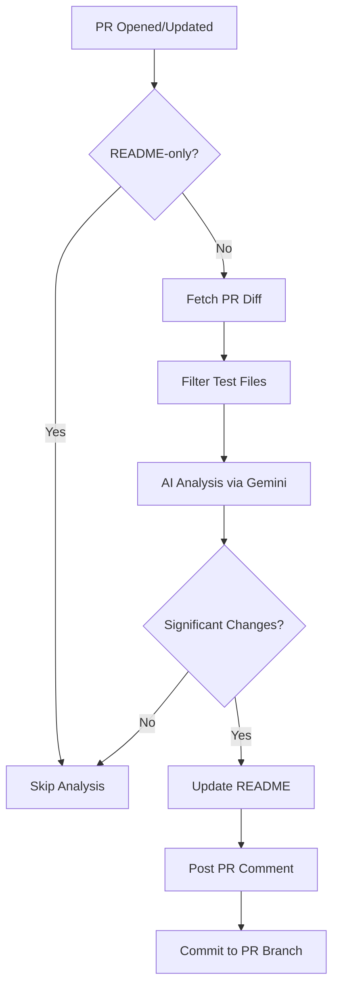

# 📚 Dynamic PR Analyzer & README Updater

An intelligent GitHub Actions-powered automation system that analyzes pull requests using **Groq AI** and automatically updates your project's README documentation based on code changes.

## ✨ Features

- **Automatic PR Analysis**: Detects significant code changes when PRs are opened or updated
- **AI-Powered Understanding**: Uses **Groq (Llama 3.3 70B)** to understand new features, removed functionality, and modifications
- **Smart README Updates**: Automatically adds, removes, or updates documentation based on changes
- **Intelligent Filtering**: Ignores test files, config changes, and README-only commits
- **Loop Prevention**: Won't trigger on its own documentation updates
- **PR Integration**: Posts detailed analysis and diff previews as PR comments
- **Zero Manual Work**: Commits README updates directly to your PR branch
- Added new email functionality
## 🚀 What It Does

When you create a pull request from a feature branch to `main`, this system will:

1. **Analyze Your Changes**
   - Fetches the PR diff using GitHub API
   - Filters out test files and non-functional changes
   - Extracts information from PR description

2. **AI-Powered Detection**
   - Identifies new functionality additions
   - Detects removed or deprecated features
   - Assesses the significance of changes

3. **Update Documentation**
   - Adds new features to README
   - Removes outdated functionality
   - Maintains README structure and formatting

4. **Request Review**
   - Posts a comment showing what was changed
   - Commits updates to your PR branch
   - You can review and approve as part of normal PR flow

## 📋 Setup Instructions

### Prerequisites

- A GitHub repository with Actions enabled
- **Groq API key (FREE!)** - Get it at [Groq Console](https://console.groq.com/)

### Installation

1. **Clone or use this repository structure**
   ```bash
   git clone <your-repo>
   cd pr_analysis
   ```

2. **Add GitHub Secret**
   - Go to your repository Settings → Secrets and variables → Actions
   - Add a new secret named `GROQ_API_KEY` with your Groq API key

3. **Copy the workflow file**
   - The `.github/workflows/pr-analyzer.yml` is already set up
   - Commit this to your `main` branch

4. **Install dependencies locally (for testing)**
   ```bash
   pip install -r requirements.txt
   ```

5. **Configure environment variables** (for local testing)
   ```bash
   cp .env.example .env
   # Edit .env with your credentials
   ```

### Configuration

The workflow runs automatically on PR events. You can customize:

- **Model**: Change `ANALYSIS_MODEL` in `.env` or workflow
- **Significance Threshold**: Adjust `MIN_CHANGE_SIGNIFICANCE`
- **File Filters**: Modify patterns in `filters.py`

## 📖 Usage

### Creating a PR

1. Create a feature branch:
   ```bash
   git checkout -b feature/my-new-feature
   ```

2. Make your changes and commit:
   ```bash
   git add .
   git commit -m "Add new feature"
   git push origin feature/my-new-feature
   ```

3. **Open a PR to `main`** on GitHub

4. The workflow automatically:
   - Analyzes your changes
   - Updates the README if needed
   - Posts a comment with the analysis
   - Commits the updated README to your branch

5. **Review the changes** in the PR comment and approve the PR!

### What Gets Ignored

The analyzer automatically skips:
- ✅ Test file changes (`*_test.py`, `*.test.js`, etc.)
- ✅ README-only commits (prevents infinite loops)
- ✅ Minor configuration file changes
- ✅ Code style/formatting changes without functional impact

### Preventing Analysis

If you want to skip the analyzer for a specific PR, include `[skip-pr-analyzer]` in your PR title or commit message.

## 🔧 Project Structure

```
pr_analysis/
├── .github/
│   └── workflows/
│       └── pr-analyzer.yml    # GitHub Actions workflow
├── analyzer.py                 # Main orchestrator
├── ai_analyzer.py             # Gemini AI integration
├── readme_updater.py          # README manipulation
├── filters.py                 # File filtering utilities
├── requirements.txt           # Python dependencies
├── .env.example              # Environment template
└── README.md                 # This file
```

## 🛠️ How It Works



## 🤝 Contributing

Contributions are welcome! To add features or fix bugs:

1. Fork the repository
2. Create a feature branch
3. Make your changes
4. Open a PR (and watch the analyzer work!)

## 📄 License

MIT License - feel free to use this in your projects!

## 🙏 Acknowledgments

- Built with [PyGithub](https://github.com/PyGithub/PyGithub)
- Powered by [Groq](https://groq.com/) - Lightning-fast LLM inference
- Inspired by the need for better documentation automation

---

**🤖 This README can be automatically updated by the PR Analyzer itself!**


**🤖 This README can be automatically updated by the PR Analyzer itself!**

**🤖 This README can be automatically updated by the PR Analyzer itself!**
